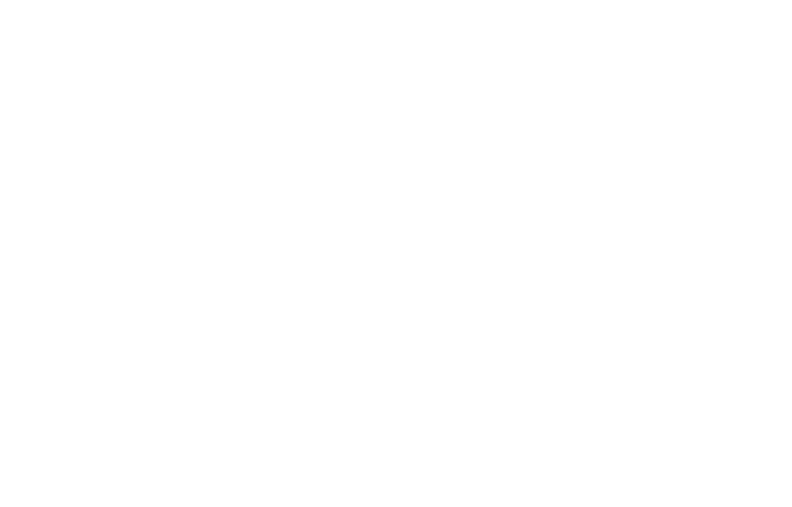

## Patterns 

(attempt at a 2d version of [Signals](https://github.com/splace/signals))

procedural rendering, that is no caching/buffering with each point independent.

flexible and small but very slow.

Status: (Beta :- stabilising API)

Overview/docs:  

Installation:

     go get github.com/splace/patterns   

Examples:

* 
* 
* 
* .png)
* 
* 
* 
* 
* 
* 
* .png)
